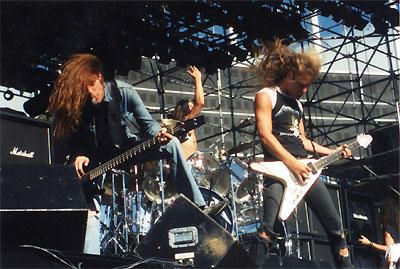
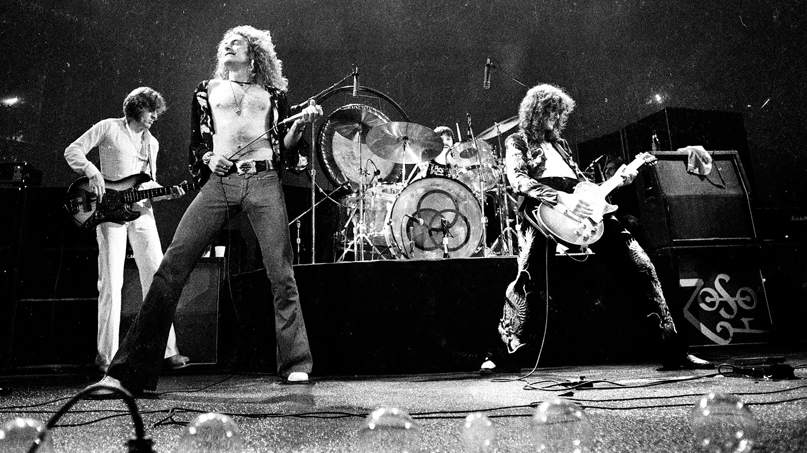

# 517-MARSH-Music
 
 Practice Repo for 517

## My favrorite bands

### Metallica

Metallica has been a part of my life since I was very young. My father would play their music whenever we were in his truck.
### Led Zeppelin

Led Zeppelin changed the way rock music was percieved. At times they played classic blues songs, but other times they would be incredibly technical and groundbreaking. All musicians within the band were well known before the band was born. Some might say this made them a "supergroup."
### Foo Fighters

I found Foo Fighters through being a fan of Nirvana. The singer, Dave Grohl, was the drummer of Nirvana. I enjoy how loud and aggressive their music is.